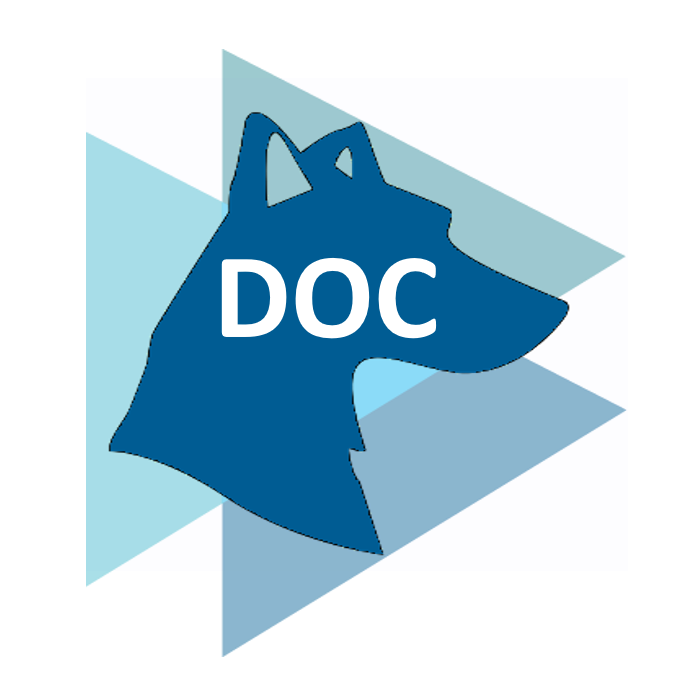

# BluDoc

BluDoc is a simple, human-readable, AI-minded, open format to describe any business document. The aim is to simplify and unify the document data exchange between business services.

## Features

- Standardized JSON schemas for document definitions
- Supports multiple document layers like pixels, texts, entities and common essential infos
- describes context, format and contents of a single document
- includes attributes facilitating AI model outputs and trainings
- is easy to read
- provides a generic schema for any document and pre-defined schemas for general business documents like e.g. invoices, etc.
- defines basic data types and normalization of related values
- can be extended and customized as needed
- Samples for various use cases

## Usage

### JSON Schemas

- Browse the `schemas` directory to find the available JSON schemas.
- Use the `samples` directory to see example documents based on the schemas.

## Documentation

For more details, visit our [documentation](https://blumatix.github.io/BluDoc/).

## Contact

For any questions, please open an issue.
